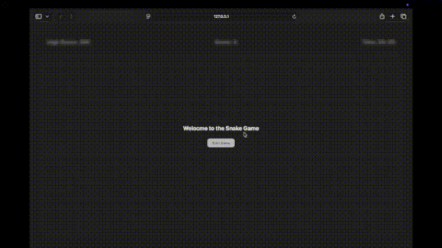

## 🐍 Snake Game 

### 🕹️ Gameplay Demo

This is a classic implementation of the Snake Game, built as a project to practice front-end development skills.

---

### ✨ Features

* **Classic Gameplay:** Control the snake to eat food and grow longer.
* **Score Tracking:** Tracks the current score and saves the **high score** using Local Storage.
* **Timing:** Keeps track of the time spent playing the game.
* **Responsive Grid:** The game board adjusts based on the screen size.

### 🚀 How to Play

1.  **Clone or Download:** Get the repository files onto your local machine.
2.  **Open:** Open the `index.html` file in your web browser.
3.  **Start:** Click the "Start Game" button.
4.  **Controls:** Use the **Arrow Keys** (Up, Down, Left, Right) to change the snake's direction.

### 🛑 Game Over

The game ends if the snake hits a wall.
